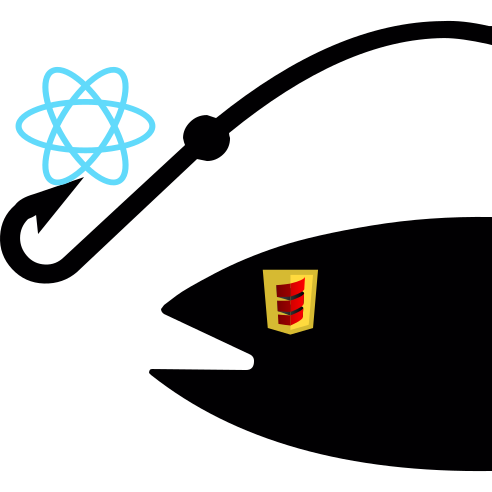

<p align="center"></p>
<p align="center"><i>Use react hooks and scala.js to catch the best user experience.</i></p>

[](https://www.scala-js.org) (react v16.8+, react-native v0.59+, scala 2.13)

Note: The documentation site is being converted to docusaurus. The demo is
available through the link below but it is a dead link in the docusaurus site. API documentation will be added back soon.

# scalajs-reaction

A react library for scala written in the spirit of ReasonReact, a react library
for an OCaml dialect known as reason (sponsored by facebook). [ReasonReact
documentation](https://reasonml.github.io/reason-react) provides a good
description of how this library works since this facade was designed to mimic
that facade. While more advanced scala functionality could have been used, the
scala.js implementation is kept intentionally similar to ReasonReact so that its
documentation applies to this project.

This facade library is small and focuses on hooks. Hooks are described on the
[react](https://reactjs.org/docs/hooks-reference.html) page.

scalajs-reaction emphasizes "easy to learn", integration into an existing
project by making it easy to import/export components and easy to fit into
existing application including those using global state-managed solutions such
as redux. At the same time, it allows you to build your entire interface in
scalajs-reaction. As long as your front-end solution can manage the model of
scala.js's output (one large module for all scala.js code, not
file-by-file/module-by-module), you should consider scalajs-react for your
solution. By providing a thin veneer over hooks, it does not provide
abstractions that are hard to code around when you need to. Things are still
achievable by users even if it takes a little code.

* [Demo (WIP)](http://aappddeevv.github.io/scalajs-reaction/demo/index.html).
* [Live Coding](https://www.youtube.com/watch?v=7on-oT2Naco): Uses the old API but still helpful.

The library supports fragments, the new context provider and hooks. The facade's
API roughly mimics ReasonReact's new approach based on hooks. This facade also
supports react-native. The react-native use-case for scala.js is actually more
compelling than for web applications due to scala.js bundling issues.

A g8 template is available. Use `sbt new aappddeevv/scalajs-reaction-app.g8` to
create a new project.

It's easy to create a component and render it:

```scala
val HelloWorld = SFC0 { div("hello world") }
reactdom.createAndRenderWithId(HelloWorld, "container")
```

SFC0 does not do much other than ensure that the scala function on the right
becomes a js function--which is all that is needed to use react hooks.

If you need to pass in an argument, just remember that react hooks requires you
to use a single js object parameter so do the following standard scala.js
approach:

```scala
trait Props extends js.Object {
    val name: String
}
val sfc = SFC1[Props] { props =>
  div("hello " + props.name)
}

def apply(props: Props) = sfc(props)
```
SFC1 says that the function component HelloWorld takes a single parameter, of
type Props.

If you want to ensure your component only renders when the props change, use
`React.memo()` to create your component. React.memo uses Object.is for equality
checking--which means it checks for exactly the same object. A pimp is available
for memo.

```scala
val sfc = SFC1[Props] { props =>
    div("hello " + props.name)
}.memo
```

Add state and other effects using hooks.

The hooks implementation in scala.js is only about 50 lines of code and is
easily maintained. Various implicits are provided to make hooks easier to use.

See the
[documentation](http://aappddeevv.github.io/scalajs-reaction) for more details.

You have choices to create your components and they are all
straightforward. Depending on the component library you use, having choices
helps you find the easiest way to access the components in your application.
This library does not force many conventions on your code and the core is quite
small now that it is based on hooks.

This facade requires more scala.js code near interactions with UI
toolkits. Higher level components, e.g. composition of smaller components, can
use more idiomatic scala constructs.

## Usage

Include the library in your build:
```scala
resolvers += Resolver.bintrayRepo("aappddeevv", "maven")
val scalaJsReactVersion = "latest.version"

// grab the the latest version or use a specific version
libraryDependencies ++= Seq(
    "ttg" %%% "scalajs-reaction-core" % scalaJsReactVersion,
    "ttg" %%% "scalajs-reaction-vdom" % scalaJsReactVersion,

    // optionals
    // if you need react-dom
    "ttg" %%% "scalajs-reaction-react-dom" % scalaJsReactVersion

    // Microsoft fabric UI components, "MS office", css-in-"scala"
    // css-in-scala can be used independently of fabric
    "ttg" %%% scalajs-reaction-fabric" % scalaJsReactVersion,

    // Material UI components (bootstrap is also available but limited)
    "ttg" %%% scalajs-reaction-mui" % scalaJsReactVersion,

    // if you integrate with redux
    "ttg" %%% "scalajs-reaction-redux" % scalaJsReactVersion,
    
    // if you need prop-types--you only need these for interop scenarios
    "ttg" %%% "scalajs-reaction-prop-types" % scalaJsReactVersion,
 
    // if you need react-native
    "ttg" %%% "scalajs-reaction-native" % scalaJsReactversion)
```

Do not forget to include the react libraries in your execution environment. For
react 16+, the libraries have been split out into multiple libraries. For the
reactjs based modules, the javascript dependencies are:

* core: react
* react-dom: react-dom

```sh
npm i --save react
npm i --save react-dom
```

React 16.8+, the one with hooks, is required.

### Styling

Styling can be performed different ways. For a quick summary of different
aspects of styling designs see this
[blog](http://appddeevvmeanderings.blogspot.com/2017/08/web-app-styling-interlude-how-to.html).

Even if you do not use Microsoft's fabric ui, fabric's `merge-styles` is
independently available and provided in the fabric facade. You can use
css-in-scala concepts to create your styles easily. See the ToDo example source
code for a detailed example. It works nicely and is independent of
fabric. `merge-styles` creates stylesheets from scala code. Here's an example
showing the use of CSS variables. `merge-styles` is a little like glamor (which
we recommend as well) but is also a bit different in that it is explicit about
"selectors". Cssinjs (react-jss) is also available as a facade library (see
scalajs-reaction github).

The slightly older idiom is below. See the examples for the updated fabric
styling idioms which are much more flexible.

```scala
  // Each key indicates an area of our component.
  @js.native
  trait ToDoClassNames extends js.Object {
    var root: String      = js.native
    var todo: String      = js.native
    var title: String     = js.native
    var dataEntry: String = js.native
  }

  def getClassNames(width: Int = 400) =
    FabricStyling.mergeStyleSets[ToDoClassNames](
      styleset(
        "root" -> new IRawStyle {
          selectors = selectorset(
            ":global(:root)" -> lit(
              "--label-width" -> s"${width}px",
            ))
         },
         "todo" -> new IRawStyle {
          displayName = "machina"
          display = "flex"
          marginBottom = "10px"
          selectors = selectorset("& $title" -> new IRawStyle {})
        },
        "title" -> new IRawStyle {
          width = "var(--label-width)"
          marginRight = "10px"
        },
        "dataEntry" -> new IRawStyle {
          display = "flex"
          selectors = selectorset("& .ms-Textfield" -> new IRawStyle {
            width = "var(--label-width)"
            marginRight = "10px"
          })
        }
      ))
}

// now use it

val cn = getClassNames()
val props = new DivProps {
  className = cn.root
}
```

If you have dynamically calculated styles, its best to memoize the result so you
do not incur the processing overhead on each component creation. The above was
static so we just create it once. To memoize, use yours or fabric's
memoize. Fabric's `memoize` needs a js function, so:

```scala
// notice the fromFunction1 conversion from scala to js.Function, the "N" is for arity
val memoizedClassNames = fabric.UtilitiesNS.memoizeFunction(js.Any.fromFunction1(getClassName))
val cn = memoized(500)
```

You can also use a scala based memoization function.

Alternatively, if you keep your CSS external and process it at build time, you
can just import your style sheets and have them picked up by your bundler such
as webpack:

```scala
@js.native
@JSImport("Examples/todo/todo.css", JSImport.Namespace)
object componentStyles extends js.Object

object styles {
  // or cast to js.Dictionary or anything else you want to use
  val component = componentStyles.asInstanceOf[js.Dynamic]
}

// use: styles.component.root
```

In the example above, you would need to ensure webpack has an alias to the
Examples directory and that you have setup your CSS processors
correctly. post-css is quite popular when using webpack. Since a Dynamics was
used, this is not type safe.

A styling trait is provided to help you ensure you only provide style attributes
for inline styling:

```scala
val hstyle = new StyleAttr { display = "flex" }

val props = new DivProps {
    style = hstyle
}
```

Styling can also be performed using scala specific libraries such as
[ScalaCSS](https://github.com/japgolly/scalacss).

### Redux

Redux integration requires you to export your component then import it with
redux enhanced props. Please see the extended documentation for details.

### Routing

A few routing pieces are included in core:

* A simple 100-line router is included based on the reason-react router
implementation. See the example app for an example of how to use it.
* An extensible router component that allows you to specify routing rules. A
  customization for browser javascripts environments is included in the vdom
  project.
* A "Route" component that slightly mimics "react-router" also in the vdom
  project. A single component handles both redirect and child rendering based on
  a router predicate.

You can apply some simple routing configuration patterns to create your own
router or use a javascript based router such as react-router. It's up to you. I
suggest creating your own since its so easy to create a function that maps
routes to components. You can use the
[sparsetech-trail](https://github.com/sparsetech/trail) library to match on URL
patterns.

### Widget Libraries

Libraries (the start of them) are provided for bootstrap, material ui and
fabric. Additional component libraries are also available. I add more as I
encounter them. It' easy and quick to create a facade, even when you create it
manually.

### Forms & Data Validation

A scalajs-react independent data-validation library is also provided that
helps abstract out data validation and it supports general form use. 

The form library (scalajs-react dependent) draws on several different reasonreact
and advanced js form libraries for inspiration of the API. 

# Documentation

Client:
* [user](http://aappddeevv.github.io/scalajs-reaction)

Integrated API documentation:
* [all basic modules](https://aappddeevv.github.io/scalajs-reaction/api/ttg/react)

# Demo

You can start the demo locally if you run `sbt npmRunDemo`. A browser page
should open automatically. If not, point your browser to
[https://localhost:8080](https://localhost:8080). You can also just load the
demo files (after its built) into your browser but note that the icons will not
render correctly since they require a fetch.

# Motivation

I was looking for a react facade that rethought reactive interactions. Many of
the existing facades are straight adaptions of the standard react library and
make it quite easy to program react in a scala environment.

The ReasonReact facade, using a modified OCaml syntax, keeps it quite
simple. This library is actually quite small and simple and relies on
functions. Scala.js easily supports creating classes that map into javascript
classes and hence into react component classes. However, with parallel fiber
coming to react and other enhancements that are planned, a more functional
library should withstand the change in the core react infrastructure to
something that is more sustainable in the long run. The current react approach
makes it easy to introduce errors both at compile time and runtime. Even with
the use of typescript, it's still quite a clunky API. Of course it is clunky for
alot of "reasons" which is why Reason and ReasonReact was born. Facebook took an
innovative approach to structuring Reason. Instead of trying to make a js
superscript, which is what typescript does well, it is trying to go orthogonal
like many other javascript transpiled languages have done e.g. elm, dart and of
course scala.js.

## Suitability
Scala.js requires a bundling model that does not allow it to be broken apart and
deployed on a pure "file/module" basis. Because of this, scalajs-react is best
suited for UIs where it is not required to code split the scala portion of the
library unless some type of fancy splitter can split apart optimized scala.js
emitted code. Scala.js makes use of optimizations, such as inlining, and
integrated type infrastructure that makes it difficult to split.

The core scala.js infrastructure costs you about 2.5k and increases as you use
features such as immutability, the collections library or, of course, add data
structures to your code.

## Related
There are a few [scala.js](https://www.scala-js.org/) react
facades/implementations available:

* https://github.com/eldis/scalajs-react: Very clean class oriented react
  implementation. Class oriented but has a builder as well and includes purely
  functional (stateless) component support as well. No macros. Allows ES
  class-like syntax. Has wrappers for japgolly. This lib was created to get
  around "wrapping" and other artifacts that the author was not fond of in
  japgolly.
* https://github.com/eldis/scalajs-redux: Redux facade by the same as above.
* https://github.com/shogowada/scalajs-reactjs: More functionally oriented
  facade. Contains redux facades and more.
* https://github.com/japgolly/scalajs-react: The can't shoot yourself in the
  foot implementation. well supported and thought out but a bit more complex API
  wise.
* https://slinky.shadaj.me: Newcomer. Uses macros smartly. Allows you to use
  scala.js components in js as well. Uses some macros to help with javascript
  interop.
* https://github.com/xored/scala-js-react: Class oriented facade. Uses macros to
  transform xml literals so you can write xml in your code like jsx.
* https://github.com/scalajs-react-interface/sri#sri: React-native and web. New
  maintainers.
* https://github.com/Ahnfelt/react4s: React wrapper. This does not just mimic
  the standard react interface. Includes an interesting CSS builder,
  css-in-scala.

The facades differ in their facade approach but many recreate all of the API
parts found in reactjs. japgolly works hard to put a more safe, functional API
in place from the outset. Some of these facades have alot of complex facade
components to help deal with the type and side-effects flexibility found in
react.

In theory, all of these can "export" a scala.js component to be used in
javascript environments. However, various libraries that go deep into scala-land
means that they are harder to use from javascript land often because they wrap
the javascript props and state objects in a way that makes them less usable from
the javascript world. Most, if not all, libraries allow you to use javascript
defined components fairly directly via some type of adoption or import process.

Libraries you may be interested in:

* [binding.scala](https://github.com/ThoughtWorksInc/Binding.scala): reactive UI
framework. It uses a new binding framework for scala. Works on jvm and js. The
binding framework is at a individual element level like mobx. You can use xml
syntax as well. The binding approach is called "precise" binding.
* [diode](https://github.com/suzaku-io/diode): redux replacement.
* [laminar](https://github.com/raquo/laminar): a reactive web framework.
* [levsha](https://github.com/fomkin/levsha): Fast pure scala.js virtual dom.
* [pine](https://github.com/sparsetech/pine): XML/HTML builder.
* [scalacss](https://github.com/japgolly/scalacss): A solid css-in-scala solution.
* [scala-dom-types](https://github.com/raquo/scala-dom-types): for dom attributes.
* [scala-tags](https://github.com/lihaoyi/scalatags): XML/HTML builder.
* [outwatch](https://github.com/OutWatch/outwatch/): reactive UI framework.
* [udash](https://udash.io/) is another reactive framework that is not
react based, but reactive.
* [udash-css](https://udash.io): A css-in-scala framework.

## License

MIT license. See the LICENSE file.

Copyright 2018 The Trapelo Group LLC.

The logo was created partially from content provided by [Scott De
Jonge](https://www.flaticon.com/authors/scott-de-jonge) under CC3.0.
