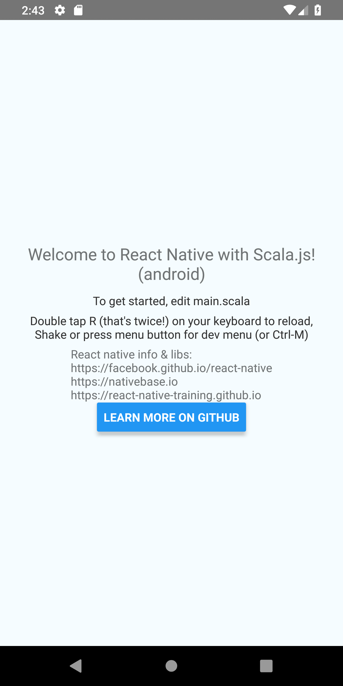

# React Native

You can easily create react native applications using this library. react native
uses a "runner" application (unlike flutter) to host the javascript execution
engine. You will need the runner skeleton to build a react native
application. The best way to do that is to follow the instructions for
installing
[`react-native-cli`](https://facebook.github.io/react-native/docs/getting-started)
and then overlaying the scalajs library on top of the generated project.

## Setup

To overlay the scala.js parts (until I create a nice g8 template with this
already in it):

* Create build.sbt as you normally would.
* Create the project folder as you normally would.
* Create source folder `mkdir -p src/main/scala` content at the top-level.

Include the core libraries:

```scala
scalajsReactVersion = ...
libraryDependencies ++= Seq(
    "ttg" %%% "scalajs-reaction-core" % scalajsReactVersion,
    "ttg" %%% "scalajs-reaction-native" % scalajsReactVersion
)
```

in your library dependencies. Create your build.sbt build file as you would for
any scala project including scala flags, etc. You can copy portions of the build.sbt file at [scala.js react template](https://github.com/aappddeevv/scalajs-react-app.g8).

Alter the index.js in the top level directory to either contain the "exported to
js" component *or* you can call `AppRegistry.registerComponent` inside of
scalajs. The scala.js function that you would call in index.js must be top level
exported (`@JSExportTopLevel`). In either case, the index.js should either use
your exported JS "app" component or call a function that calls
`registerComponent`.

You may want to include `"org.scala-js" %%% "scala-js-dom" % "latest.version"`
to include scala support for some of the available polyfills such as
`fetch`. There is no DOM on the mobile devices, so the DOM parts of this library
are not available and you should not use them.

That's all you need for setup to get started.

## Enhanced Setup

If you want to copy your scalajs output to a well known location so that you
only need to change your index.js (located in the toplevel directory) once, you
can set up a file copy task that copies the output of fullOptJS or
fastOptJS. You would run this task after the scala.js full/fast
processing. index.js is the default starting point for javascript bundling when
using the react-native cli such as `react-native run-android`. 

The metro bundler looks for index.js to create the javascript resource
graph. Instead of modifying the output of sbt, you can also use build vars in
javascript to switch between targets--a typical approach in javascript
e.g. include min if you are in a dev build. Below is the copy approach. If your
final scala.js project that creates the linked javascript artifact is always the
same, it is probably easier to hardcode the path with conditionals in index.js.

However, let's just assume that you want to keep index.js unchanged and want to
map full or fast builds to the same output file.

You will want to scope the task to the respective scala.js linkage tasks,
fastOptJS or fullOptJS so that the correct artifactPath is picked up.

```scala
lazy val root = ...
  //...
  // rename outputs
  .settings(artifactPath.in(Compile, fastOptJS) := crossTarget.in(Compile, fastOptJS).value / "Scala.js")
  .settings(artifactPath.in(Compile, fullOptJS) := crossTarget.in(Compile, fullOptJS).value / "Scala.js")

// Copy output to the current dir, which is where build.sbt runs.
// Could use another directory as well e.g. src or dist
val copyOutputDir = "."

def copyJSAndMap(src: File): Unit = {
  println(s"Copying: [$src] to [$copyOutputDir]")
  val outputName = src.name
  val mapOutputName = src.name + ".map"
  IO.copyFile(src, file(outputName), true, true)
  IO.copyFile(file(src.getCanonicalPath() + ".map"), file(mapOutputName), true, true)
}

lazy val copyJSOutput = taskKey[Unit]("copy scala.js output to well known location")

// no scoping as we use scalaJSLinkedFile, which is independent of *OptJS,
// instead of artifactPath which is dependent on a specific *OptJS
copyJSOutput := {
  val infile = scalaJSLinkedFile.in(Compile).value.path
  copyJSAndMap(file(infile))

}

// trigger the copy after an *OptJS task is run
// depending on project structure, scope to the project
// run a clean before switching targets
fastOptJS / copyJSOutput := (copyJSOutput triggeredBy fastOptJS.in(Compile)).value
fullOptJS / copyJSOutput := (copyJSOutput triggeredBy fullOptJS.in(Compile)).value
```

There are many ways to do this in sbt including using artifactPath (scoped to
the fast or full task inside Compile) to copy the file and standardize its output
name for react-native.

Managing task running in sbt is covered in the
[manual](https://www.scala-sbt.org/release/docs/Tasks.html) as there are a few
different ways to set the above copy operation up some of which are more simple
then defining a task. A really great blog on sbt tasks is
[here](https://binx.io/blog/2018/12/08/the-scala-build-tool/), you should read
it just to be smarter about sbt.

Here's a [stackoverflow](https://stackoverflow.com/questions/29371654/scala-js-compilation-destination/29375359#29375359) article on the same topic.

## Calling AppRegistry.registerComponent in scala.js

If your index.js file imports a function that performs the registration you need
to write the registration function in scala first:

```scala
@JSExportTopLevel("Main")
object Main {
  @JSExport("main")
  def maian(): Unit = {
    AppRegistry.registerComponent("HelloWorld", () => App.JS)
  }
}

```

Regardless of whether you call `registerComponent` in scala or JS, you need to
create the application component. That's easy. Don't forget to "wrap" it for JS
use. 

In the code below, the component itself is exported so you can call
`registerComponent` in index.js. If you call `registerComponent` in scala as
show above, you do not need to export the anything related to the component but
it still need to be wrapped.

```scala
@JSExportTopLevel("App")
object App {
  val Name = "App"
  val c = statelessComponent(Name)
  import c.ops._
  
  def apply() = render { self =>
    View()(
        Text()("This is some text.")
    )
  }
  
  @JSExport("JS")
  val JS = c.wrapScalaForJs[js.Object](_ => App())
}

```

The top level is usually a stateless component as it is called by the
react-native framework and does not take any arguments.

If you have your exports setup using either approach, your index.js should
include the scala.js output:

```javascript
// index.js
// Adjust for your output or use the copy method described above.
// We assume you used the "copy to a well know location" below.

// Scala.js runs registerComponent inside Main.
import { Main } from "./Scala.js"

// JS calls registerComponent inside index.js.
import { App } from "./Scala.js"

// Let Main run...
Main.main()
// or let javascript run...
AppRegistry.registerComponent(appName, () => App.JS)
```

If you want to switch on the build type in javascript and skip the sbt
configuration above, use an ES6 feature with dynamic imports (make sure its
enabled in your environment if you need to):

```
if(process.env.NODE_ENV === "production") then { 
const Main = import("./target/scala-2.12/app-opt.js")
}
else {
const Main = import("./target/scala-2.12/app-fastopt.js")
}
```

If you don't have ES6 support you could use the legacy "require(...)"  which
should be supported for some time to come with most bundlers. The default
react-native metro should allow the dynamic import using `import`. If you use
this approach, make sure any imported resources such as images are available
based on a path relative to the js file as your scala or js imports inside of
app-opt.js/app-fastopt.js will now be relative to the target/scala-2.12
directory.

## Build

Run sbt as you normally would and during dev and use `~fastOptJS` if you used
the triggered approach to perform the scala.js output copy. That allows you to
recompile as needed. react native uses its own JS packager, called metro, that
restructures your JS similar to webpack.

metro is not as feature-rich as webpack. When you run `react-native run-android`
it first runs gradle to build the java part of the project and it starts up a JS
server similar to the way that webpack-dev-server works. It is suppose to detect
changes in js files and do a hot reload. You may need to turn on hot reloading
using Ctrl+M (linux/windows hosted emulators).

## Helpers

While you should install android studio because you will probably need to write
some interop at some point, you can start the emulator without starting android
studio:

```sh
# List emulator devices.
$ emulator -list-devs

# Start an emulator I defined in android studio.
$ emulator -avd Pixel_2_XL_API_28 -no-boot-anim
````

You will want to add:

```sh
export ANDROID_HOME=$HOME/Android/Sdk
export PATH=$PATH:$ANDROID_HOME/emulator
export PATH=$PATH:$ANDROID_HOME/tools
export PATH=$PATH:$ANDROID_HOME/tools/bin
export PATH=$PATH:$ANDROID_HOME/platform-tools
```

to a shell script you can import into your current terminal.

## Other Libraries

There are some ports of common libraries, all WIP and some have no code yet :-):

* react-navigation (working)
* sideswipe (working)
* nativebase (no code yet)
* react-native-elements (no code yet)

Creating facades is easy. It only took 3 hours to create the entire facade for
react-native from scratch when I did not even know react-native. I just look at
the typescript definitions and develop a scala.js friendly API from there. I
believe that a good combination is to use scala.js and typescript together.

## Resources

Widget/other libraries:

* [nativebase](https://docs.nativebase.io)
* [react-native-elements](https://react-native-training.github.io/react-native-elements)
* [icons](https://github.com/oblador/react-native-vector-icons)

## Result

Here's a simple screen using Text and Button.

{:width="300px"}

app.scala

```scala
import scala.scalajs.js
import js.annotation._
import js.JSConverters._
import concurrent._
import concurrent.ExecutionContext.Implicits.global

import ttg.react
import react._
import elements._
import react.implicits._
import ttg.react.native
import native._
import native.styling._

object App {

  val instructions = Platform.select(choices[String](
    "ios" ->
      "Press Cmd+R to reload,\nCmd+D or shake for dev menu",
    "android" ->
      ("Double tap R (that's twice!) on your keyboard to reload,\n" +
      "Shake or press menu button for dev menu (or Ctrl-M)"),
  ))

  def handleClick(url: String): Unit =
    for {
      supported <- Linking.canOpenURL(url).toFuture
      _ <- if (supported) Linking.openURL(url).toFuture
      else Future{println("Unable to open URI: " + url)}
    } yield ()

  val url = "https://aappddeevv.github.io/scalajs-react/docs/native.html"

  val Name = "App"
  val c = statelessComponent(Name)
  import c.ops._

  def apply() = render { self =>
    View(new View.Props {
      style = styles.container
    })(
      Text(new Text.Props {
        style = styles.welcome
      })(s"Welcome to React Native with Scala.js! (${Platform.OS})"),
      Text(new Text.Props {
        style = styles.instructions
      })("To get started, edit main.scala"),
      Text(new Text.Props {
        style = styles.instructions
      })(instructions),
      Text(new Text.Props {
      })(
        "React native info & libs:\nhttps://facebook.github.io/react-native\nhttps://nativebase.io\nhttps://react-native-training.github.io"
      ),
      Button(new Button.Props {
        val title = "Learn More on Github"
        val onPress = _ => handleClick(url)
      })()
    )
  }

  @JSExport("JS")
  val JS = c.wrapScalaForJs[js.Object](_ => App())//_ => apply())

  trait Styles extends StyleSet {
    val container: ViewStyle
    val welcome: TextStyle
    val instructions: TextStyle 
  }

  val styles = StyleSheet.create(
   new Styles {
     val container = new ViewStyle {
      flex = 1
      justifyContent = JustifyContent.center
      alignItems = FlexAlignType.center
      backgroundColor = "#F5FCFF"
    }
    val welcome = new TextStyle {
      fontSize = 20
      textAlign = TextAlign.center
      margin = 10
    }
    val instructions = new TextStyle {
      textAlign = TextAlign.center
      color = "#333333"
      marginBottom = 5
    }}
  )
}
```

main.scala:

```scala
import scala.scalajs.js
import js.annotation._

import ttg.react.native
import native._

@JSExportTopLevel("Main")
object Main {
  @JSExport("main")
  def main(): Unit = {
    AppRegistry.registerComponent("HelloWorld", () => App.JS)
  }
}
```

index.js:

```js
import {AppRegistry} from 'react-native'
import {name as appName} from './app.json'
import { Main } from "./Scala.js"

Main.main()
```
